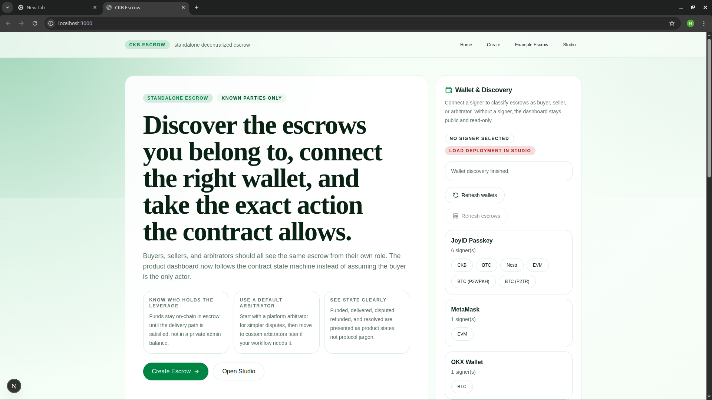

# Nervos Builder Track — Weekly Report (Week 12)

**Name:** Ekene Nwobodo  
**Focus:** Product UX, Role-Aware Discovery, and Settlement Preparation  
**Week Ending:** 19-04-2026  

---

## 🎯 Overview

Week 12 focused on making the escrow frontend feel more like a usable product.

The work this week improved:

- buyer-facing presentation
- mobile navigation
- role-aware escrow discovery
- settlement preparation for participant-driven actions

This was the week where the system moved closer to real user interaction instead of remaining mainly an admin or studio tool.

---

## 🔗 Repositories

- Escrow Frontend / Product Shell  
  https://github.com/kayceeDev/ckb-escrow-test-frontend

- Escrow Contract (Rust / CKB Script)  
  https://github.com/kayceeDev/ckb-escrow

---

## 🏗 What I Built

### 1. Product Experience Improvements

The frontend received a major round of presentation and usability improvements.

Work completed:

- refined the product shell and studio presentation
- fixed and stabilized the Next.js Tailwind pipeline
- polished the buyer-facing product experience
- improved the buyer-facing home experience
- added mobile navigation menu

These changes made the interface feel more coherent and easier to navigate.

---

### 2. Role-Aware Escrow Discovery

One important improvement was making the frontend understand who the connected user is relative to a given escrow.

The app now distinguishes between:

- buyer
- seller
- arbitrator
- viewer

This role-aware approach makes the interface more accurate, because available actions now reflect both:

- escrow state
- participant role

---

### 3. Action and Settlement Flow Improvements

The escrow detail flow became much more useful this week.

Work completed:

- improved escrow detail behavior
- added direct action support where the transaction can be triggered immediately
- preserved studio handoff for flows that still need additional context
- added participant script settlement flow

This is important because some escrow outcomes require more than a lock hash. They need the participant’s full script so payout or resolution transactions can be built correctly.

---

### 4. Participant Script Registry

To support settlement-related flows, the frontend now stores participant script data.

This helps the app:

- map connected wallets to escrow roles
- recover participant script information when needed
- prepare more complete payout and resolution flows

This is a practical improvement toward end-to-end operation of the escrow system.

---

## 🧠 Key Learnings

### 1. Good UX on CKB Must Respect Protocol Reality

Not every escrow action is equally simple.

Some actions can be handled directly, while others need:

- recipient lock scripts
- richer transaction context
- additional validation inputs

The frontend has to reflect that honestly.

---

### 2. Identity and Settlement Are Related but Different

Earlier work treated `lock_hash` as identity, which is correct for authorization in many cases.

This week added a deeper realization:

> identity alone is not always enough for settlement.

When funds need to be routed to a participant, the application may need the full script, not only the hash.

---

### 3. Product Quality Improves Understanding

Polishing the interface was not just cosmetic.

As the product became clearer, it also became easier to see:

- where transaction flows are smooth
- where they still require manual support
- which actions can be direct and which still belong in the studio flow

---

## 🚧 Current State

By the end of Week 12, the project now demonstrates:

- a product shell with better presentation
- mobile-aware navigation
- role-aware escrow discovery
- better escrow detail and action handling
- participant-script-backed settlement preparation

Still missing:

- full live completion of every settlement path on testnet
- more seamless end-to-end transaction submission UX
- broader verification across all dispute and payout flows

---

## 🔜 Next Steps

- complete and validate live settlement flows
- reduce manual steps around participant script handling
- improve transaction execution feedback in the product UI
- keep refining the product experience while preserving studio capabilities

---

### Screenshots

## 💡 Reflection

Week 12 felt like a move from prototype interface to product thinking.

The question is no longer only whether the escrow logic works. It is now whether users can discover, understand, and safely operate that logic through a clean interface.
